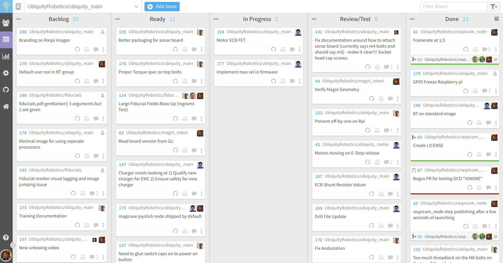
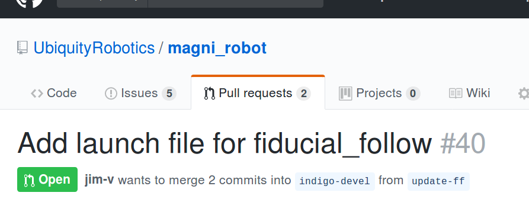

# Github/Waffle Powered Workflow

## Rationale

* Code changes should not be made directly to the main branch, this leads to chaos if multiple people are working, and doesn't allow for code to be thoroughly reviewed.
* All code changes must be done through a Pull Request (PR) so that others can easily comment on them. 
* Most documentation changes can be made by committing to the main branch. Proposals for major additions/changes should be done with a PR.
* All PRs must be approved and passing all tests before being merged.

## Overview of Waffle
Waffle is a kanban board (like Trello) interface to Github Issues and Pull Requests.
It can be found here: [Ubiquity Robotics Waffle](https://waffle.io/UbiquityRobotics/ubiquity_main).

> 

Issues are organized into 5 columns: Backlog, Ready, In Progress, Review/Test, and Done.
If all is well, then issues move to the right (towards done) over time.

### Backlog
This is for issues/ideas that have come up, but there is no plan for resolving them at the moment.

### Ready
The Ready column is for issues ready to be worked on. The following criteria should be met for something to be here.

- Someone is assigned to the issue
- There is a somewhat clear idea of what needs to happen to close the issue (Definition of Done)
- The team decided to give it some priority.

### In Progress
Pretty straight forward: someone is working on it.

### Review/Test
Close to complete, but is waiting on further testing or code review.

### Done
Your done! The PR is merged or the issue is closed.

## Workflow for making a code change

1. Make an issue describing what feature you are adding, or what bug you are fixing (unless an issue is already filed) in the repository you are changing. This is not strictly necessary if you are making a docs change or contributing a blog. Assign the issue to yourself to claim it.

2. Create a branch in the repo. If the change will only be in one repo, name the branch bugfix-#XX or feature-#XX, where XX is the issue number that you are working on. If the change is across multiple repos, or there is no issue tracking it, then name the branch something more descriptive.

3. Do the work, committing and pushing to your branch as you go.

4. Create a pull request between your branch and the default branch (generally kinetic). In the pull request description, put 'Fixes #XX' where XX is the issue number. Add so people as requested reviewers on the PR as well, generally for code that would be @rohbotics or @jim-v, and for documentation @davecrawley. Some repos will be "owned" by someone else, in which case they should be reviewers.

5. Once you have made any changes requested through review, and your PR has been approved, you can merge if the button is green. Some repositories have automatic unit testing, and if they fail, these will be reported in the PR, so please address the failures before merging,


## Workflow for testing a pull request

Pull requests can be viewed in [Github](https://github.com/UbiquityRobotics).
They will looks something similar to the screen shot below.

> 

In this example, the work has been done in a branch named `update-ff`, so a
local copy of that branch must be obtained to test the changes.

This should be done in a _catkin workspace_. For guidance on creating a 
catkin workspace, refer to the [Installing and configuring your ROS environment tutorial](http://wiki.ros.org/ROS/Tutorials/InstallingandConfiguringROSEnvironment).

Once you have your catkin workspace, you can clone the repo and switch to the
branch as follows:
```
cd ~/catkin_ws/src
git clone git@github.com:UbiquityRobotics/magni_robot.git -b update-ff
```

However, if you already had a local copy of the repo, you could switch to the
`update-ff` branch as follows:
```
roscd magni_robot
git pull
git checkout update-ff
```

After that, it will normally be necessary to build the new software:
```
cd ~/catkin_ws
catkin_make
```

Note that packages built from source will be in the path before packages
installed as binaries with `apt-get`.

